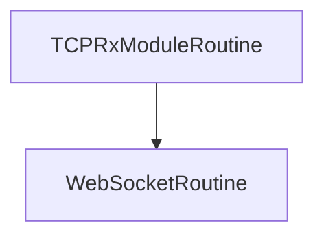

# Go_TCP_Websocket_Adapter

## Summary

This application listens on a TCP connection for TimeChunk JSON bytes. It will accumulated them, extract the JSON data and then transmit it on a web socket to a Svelte kit UI

## Routines

The routines folder contains descriptions of the routines used by this program

## Block Diagram

