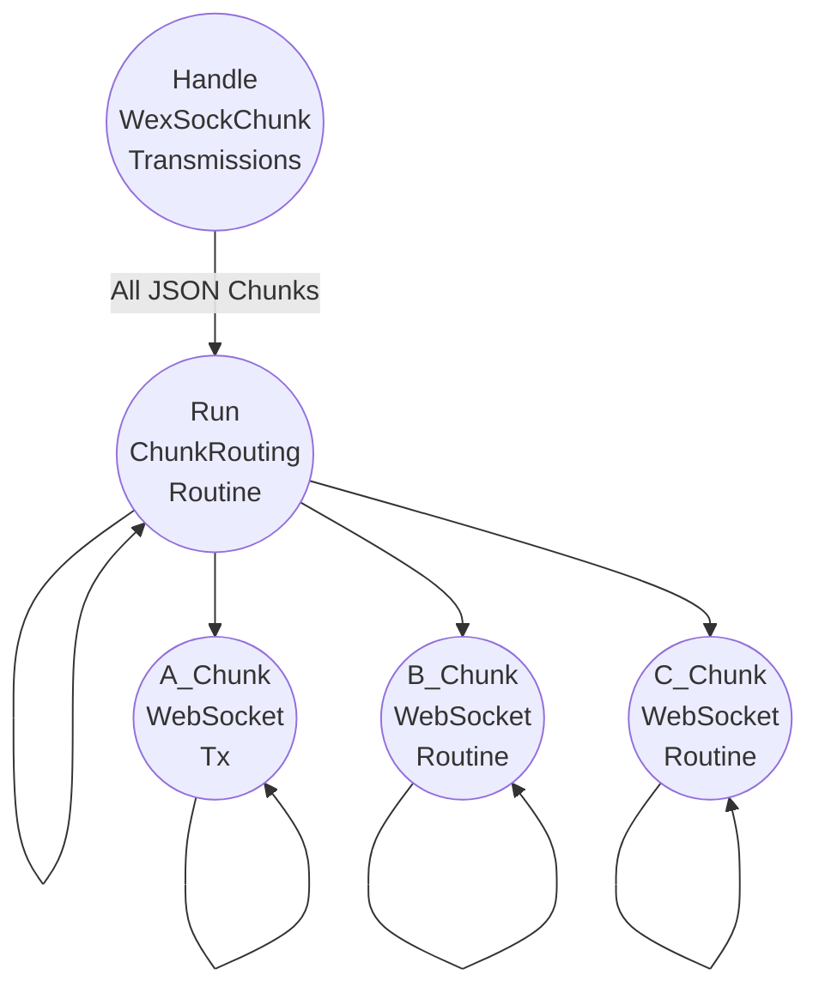

# Routine Explanations

## TCPRXRoutine

## WebSocketRXRoutine

```mermaid

graph TD;
    A((Handle \n WexSockChunk \n Transmissions )) --All JSON Chunks--> B((Run \n ChunkRouting \n Routine))
    B --> B
    B --> C((A_Chunk \n WebSocket \nTx))
    C --> C
    B --> D((B_Chunk \n WebSocket   \n Routine))
    D --> D
    B --> E((C_Chunk \n WebSocket   \n Routine))
    E --> E
```